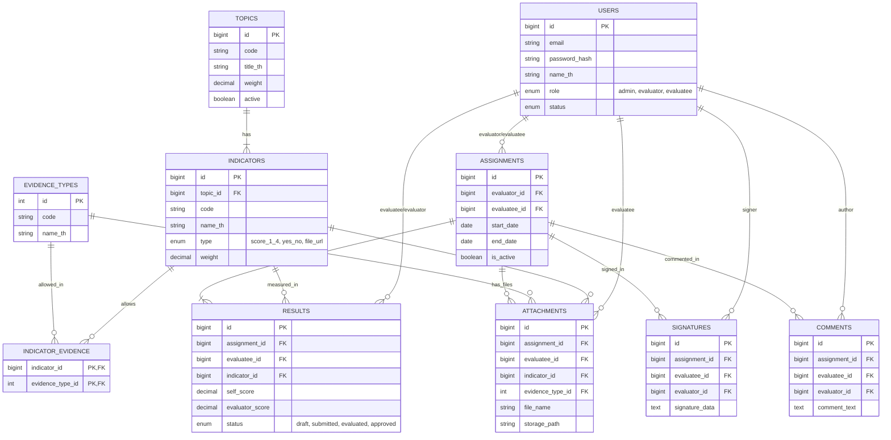

# Database ER Diagram

แผนภาพความสัมพันธ์ของฐานข้อมูล (Entity-Relationship Diagram) จาก `schema.sql`

## คำอธิบายความสัมพันธ์ (Relationships)

1.  **Users (ผู้ใช้งาน)**: เป็นศูนย์กลาง เชื่อมโยงกับเกือบทุกตาราง
    *   เป็น `Evaluator` (ผู้ประเมิน) หรือ `Evaluatee` (ผู้ถูกประเมิน) ในตาราง `Assignments`
    *   เป็นเจ้าของคะแนนใน `Results`
    *   เป็นเจ้าของไฟล์ใน `Attachments`

2.  **Assignments (การมอบหมายงาน)**: เป็นตารางหลักในการเชื่อมโยงช่วงเวลาและการจับคู่
    *   กำหนดว่า ใครประเมินใคร (Evaluator -> Evaluatee)
    *   กำหนดช่วงเวลา (Start/End Date)
    *   ข้อมูลคะแนน (Results), ไฟล์แนบ (Attachments), ลายเซ็น (Signatures) จะผูกกับ Assignment ID นี้เสมอ

3.  **Topics & Indicators (หัวข้อและตัวชี้วัด)**: เป็น Master Data
    *   Topic 1 หัวข้อ มีได้หลาย Indicators (1:N)
    *   Indicator แต่ละตัว กำหนดได้ว่าต้องใช้หลักฐานประเภทไหนบ้าง (ผ่านตาราง `Indicator_Evidence`)

4.  **Results (ผลการประเมิน)**: เก็บคะแนน
    *   เก็บแยกราย Assignment + Evaluatee + Indicator (Unique Key)
    *   มีช่องเก็บคะแนนตนเอง (`self_score`) และคะแนนกรรมการ (`evaluator_score`)

5.  **Cascade Delete**:
    *   ถ้าลบ `Assignment` -> ข้อมูลลูก (Results, Attachments, Signatures) จะหายไปทั้งหมด (Clean)
    *   ถ้าลบ `User` -> ข้อมูลที่ User นั้นเป็นเจ้าของจะหายไป (Clean)
